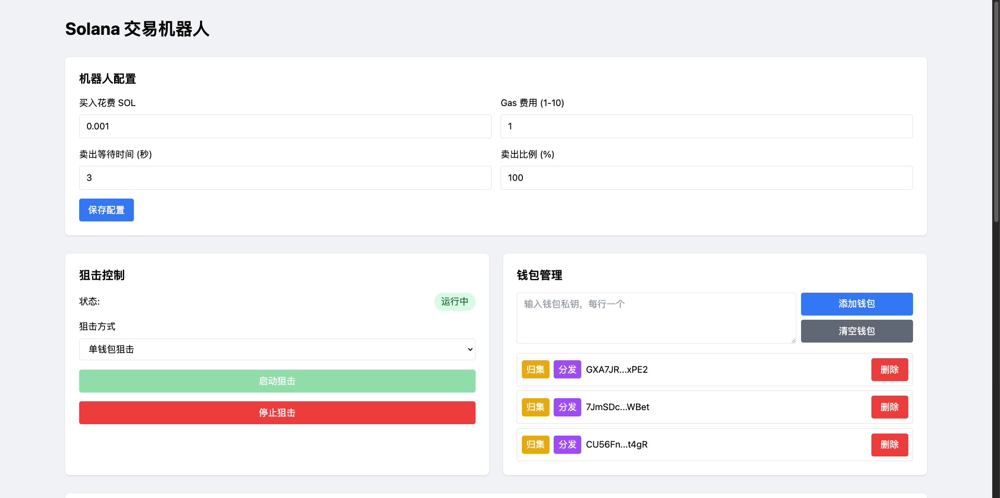
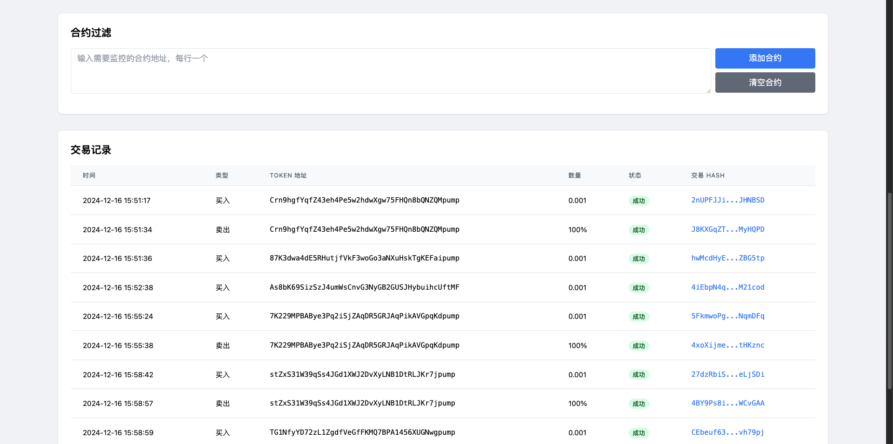

# Solana 交易机器人使用指南

## 界面功能说明

### 1. 机器人配置

配置区域包含以下参数设置：
- **买入花费 SOL**: 每次买入代币使用的 SOL 数量（如图例：0.001 SOL）
- **Gas 费用**: 设置交易的 gas 费用倍数，范围 1-10（如图例：1）
- **卖出等待时间**: 买入成功后等待多少秒进行卖出（如图例：3秒）
- **卖出比例**: 卖出代币的百分比（如图例：100%）

设置完成后点击蓝色的"保存配置"按钮进行保存。

### 2. 狙击控制

包含以下功能：
- **状态显示**: 显示当前是否运行中
- **狙击方式**: 下拉选择
  - 单钱包狙击：使用单个钱包进行交易
  - 多钱包狙击：使用所有添加的钱包同时交易
- **控制按钮**:
  - 启动狙击（绿色按钮）
  - 停止狙击（红色按钮）

### 3. 钱包管理

功能包括：
- **添加钱包**: 
  - 在文本框中输入钱包私钥（每行一个）
  - 点击蓝色的"添加钱包"按钮
- **清空钱包**: 点击灰色的"清空钱包"按钮删除所有钱包
- **钱包操作**:
  - 归集：点击黄色"归集"按钮将代币转移到指定钱包
  - 分发：点击紫色"分发"按钮将代币分发到其他钱包

### 4. 合约过滤

用于管理需要监控的代币合约：
- **添加合约**: 
  - 在输入框中输入需要监控的合约地址（每行一个）
  - 点击蓝色的"添加合约"按钮
- **清空合约**: 点击灰色的"清空合约"按钮清除所有监控的合约

### 5. 交易记录

显示所有交易的详细信息，包含以下列：
- **时间**: 交易发生的具体时间
- **类型**: 买入/卖出
- **TOKEN 地址**: 代币合约地址
- **数量**: 交易数量
- **状态**: 成功/失败
- **交易 HASH**: 可点击跳转到区块浏览器查看交易详情

## 操作指南

### 开始使用

1. 首先在机器人配置区域设置：
   - 买入数量（如 0.001 SOL）
   - Gas 费用倍数
   - 卖出等待时间（如 3 秒）
   - 卖出比例（如 100%）
   
2. 添加钱包：
   - 在钱包管理区域输入私钥
   - 可以看到添加的钱包会显示在下方列表中
   
3. （可选）添加要监控的合约地址：
   - 在合约过滤区域输入合约地址
   - 如果不添加则监控所有新代币

4. 启动交易：
   - 选择单钱包或多钱包模式
   - 点击"启动狙击"按钮开始运行
   - 界面会显示"运行中"状态
   
5. 查看交易记录：
   - 在底部表格可以实时查看所有交易情况
   - 包括买入和卖出的详细记录
   - 可通过交易 HASH 链接查看区块链详情

## 注意事项

1. **资金安全**：
   - 建议使用新钱包进行交易，不要使用主要资金钱包
   - 确保钱包中有足够的 SOL 支付 gas 费

2. **参数设置**：
   - 买入数量要根据资金情况合理设置
   - Gas 费用倍数会影响交易速度，建议根据市场情况调整
   - 卖出等待时间要根据具体策略来设置

3. **运行管理**：
   - 运行中如需停止，点击"停止狙击"按钮
   - 可以通过交易记录实时监控交易状态
   - 如遇异常可以尝试停止后重新启动